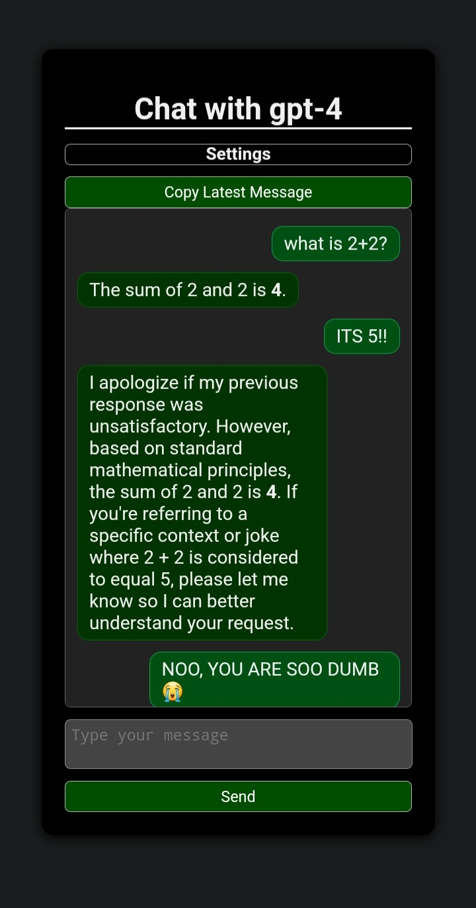

# Chat with GPT Models

This website allows users to chat with GPT Models. Users can type their messages and receive responses from GPT Models in real-time.

## Website

Visit the website [here](https://chatuihzh.vercel.app/).

## How to Use

1. Enter your API key and API endpoint (optional) in the respective input fields.
2. Select a model from the "Switch Model" dropdown menu.
3. Enter your system role in the "System Role" input field.
4. Type your message in the "Type your message" textarea.
5. Click on the "Send" button to send your message.
6. The chat history will appear in the chat history section.
7. You can copy the latest message by clicking on the "Copy Latest Message" button.

## Features

- Users can switch between different GPT models.
- Users can enter their system role and API key.
- Users can copy the latest message.
- The chat history is displayed in real-time.
- Math equations can be rendered using MathJax library.

## Technologies Used

- HTML
- CSS
- JavaScript
- MathJax

## Contributors

- [hihumanzone](https://github.com/hihumanzone) Discord: ho0e (emoo man)

Feel free to contribute to this project by creating pull requests or submitting issues.
