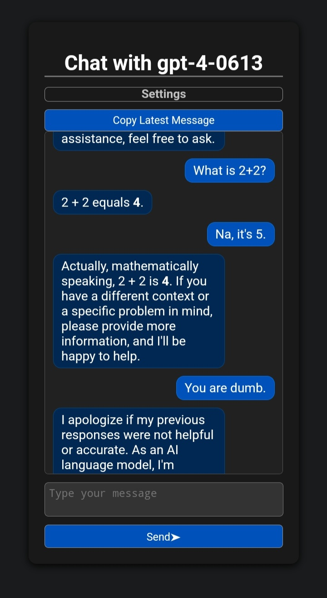
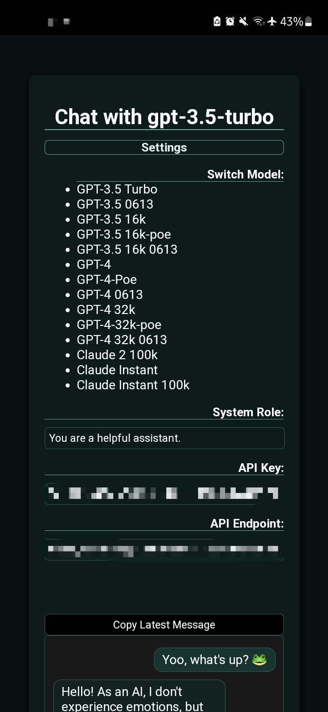

# Chat with GPT Models

This repository contains the code for a web application that allows users to chat with GPT models. 

## Features

- Users can select a GPT model to chat with from the settings menu.
- Users can enter their API key and API endpoint to authenticate with the model.
- Users can set their system role for the conversation.
- Users can send messages and receive responses from the GPT model.
- Users can clear the chat history.
- Users can copy the latest message to the clipboard.

## Usage

To use this web application, follow these steps:

1. Visit the [Chat with GPT Models](https://chatuihzh.vercel.app/) website.
2. Enter your API key and API endpoint in the respective input fields.
3. Optionally, set your system role in the system role input field.
4. Select a GPT model from the model list.
5. Start the conversation by typing a message in the message input field and pressing the "Send" button or the Enter key.
6. The GPT model will provide a response, which will be displayed in the chat history.
7. To copy the latest message, click the "Copy Latest Message" button.
8. To clear the chat history, click the "Clear Chat History" button.

## Screenshots

## Technologies Used

- HTML
- CSS
- JavaScript

## Contributors

- [hihumanzone](https://github.com/hihumanzone) Discord: ho0e (emoo man)

Feel free to contribute to this project by creating pull requests or submitting issues.
