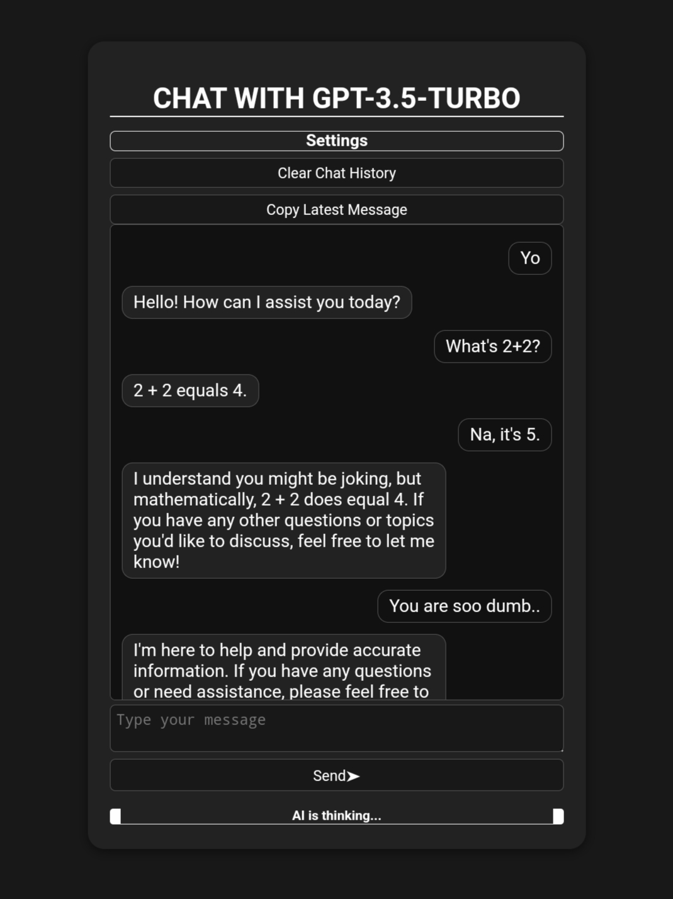
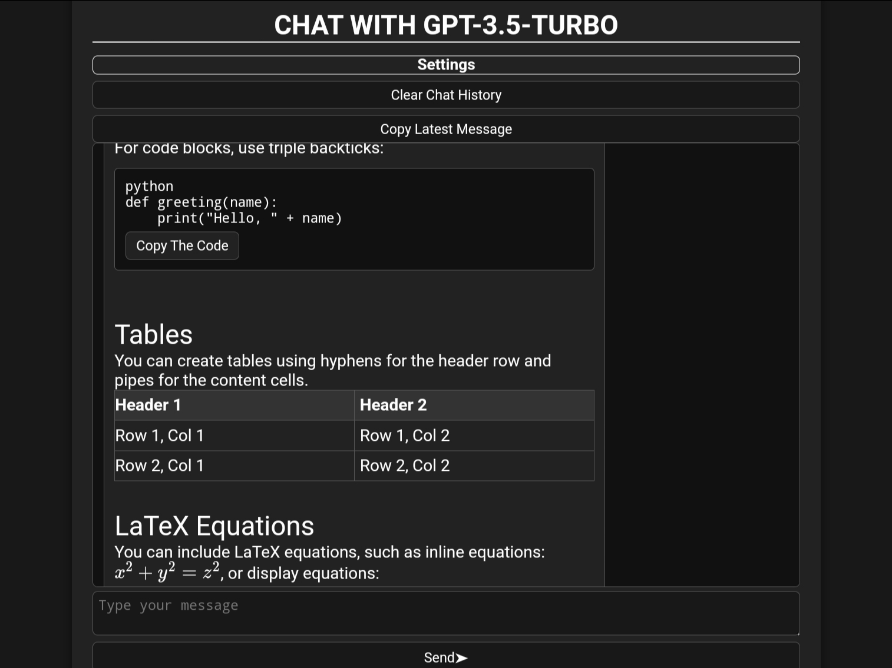
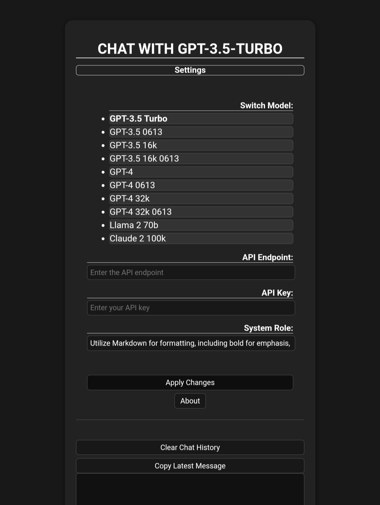

# Chat with GPT Models

## Overview
This repository houses the web interface to chat with various OpenAI GPT models. The chat interface offers an intuitive design and easy settings management.

## Features
1. **Multiple Models**: The interface supports a variety of OpenAI models, from GPT-3.5 to GPT-4, including variations such as Llama and Claude.
2. **Dynamic Model Switching**: Users can easily switch between models from the settings dropdown.
3. **Configurable API Endpoint and Key**: Users can provide their own API endpoint and key.
4. **Persistent Settings**: Model choice and other settings are stored locally for convenience.
5. **Responsive Chatbox**: The chatbox is dynamic, adjusting its height based on the content.
6. **Rich Text Formatting**: The chat interface supports various markdown-based formats like bold, italic, code blocks, inline code, and mathematical notation.

## Usage
Visit [this link](https://chatuihzh.vercel.app/) to access the chat interface.

## Configuration
1. Click on the 'Settings' button to access the model menu.
2. From the dropdown, choose your desired model.
3. Provide the API endpoint and API key.
4. (Optional) Customize the system role.
5. Click on 'Apply Changes' to save your settings.
6. Type your message in the chatbox and click 'Send' or press 'Enter' to communicate with the chosen AI model.

## Technical Details
- The interface is built using vanilla HTML, CSS, and JavaScript.
- It utilizes local storage to save user settings, ensuring a seamless experience across sessions.
- The JavaScript logic handles API calls, chat history, and message formatting.

## Note
Please ensure you have the necessary permissions and API limits before interacting with the OpenAI models.

## Contributors

- [hihumanzone](https://github.com/hihumanzone) Discord: ho0e (emoo man)

Feel free to contribute to this project by creating pull requests or submitting issues.
